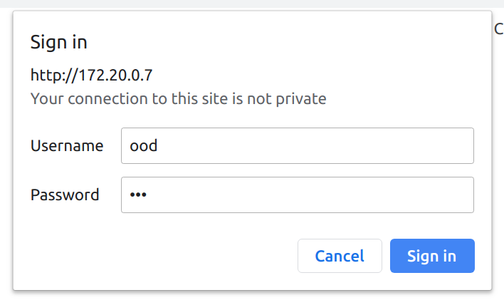
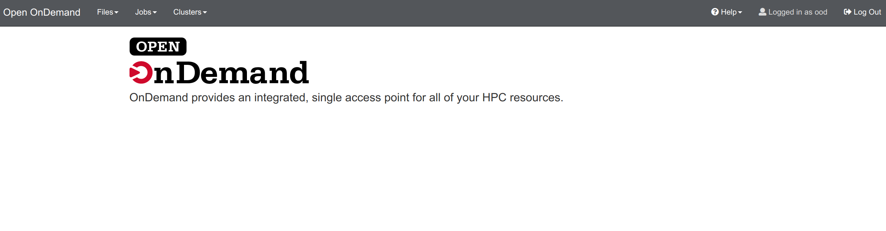
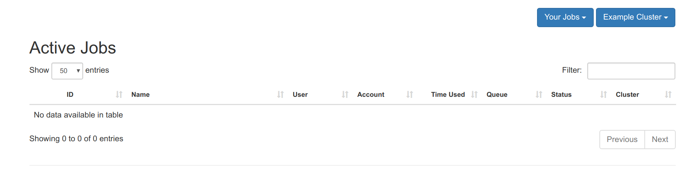
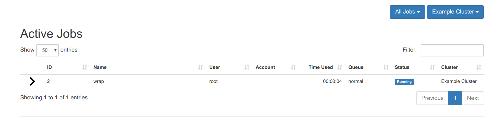
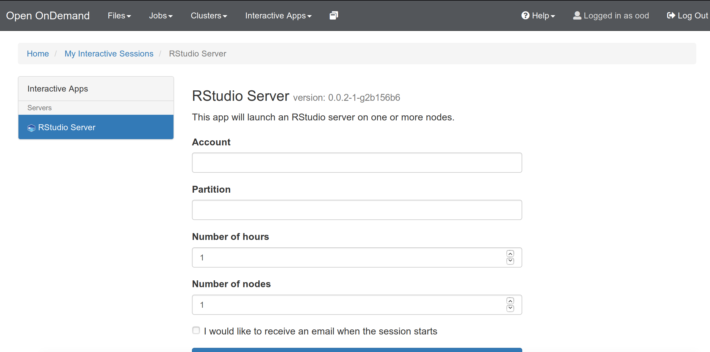
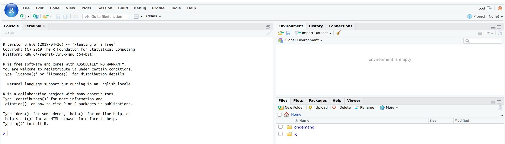

# Open On Demand Compose

This is an Open On Demand (OOD) instance installed with SLURM using docker-compose.
We use docker-compose to bring up a master node, worker nodes, and we store
data and log files in a mounted volume. The slurm configuration was adopted
from [slurm-docker-cluster](https://github.com/giovtorres/slurm-docker-cluster)
combined with [ood-vagrant](https://github.com/OSC/ood-images-full/).


## Getting Started

The base image for slurm is built by the Dockerfile in this repository. It
serves slurm 18.08.6

```bash
$ docker build -t vanessa/slurm:18.08.6 .
```

It's also available on [Docker Hub](https://hub.docker.com/r/vanessa/slurm),
but it's still useful for you to build on your own for the latest version.
After this first build or pull, we then build the nodes, which have additional VNC libraries,
and (if you have particular dependencies for apps) they are installed here:

```bash
$ docker-compose build
```

Then start the cluster:

```bash
$ docker-compose up -d
```

Confirm that containers are running:

```bash
  Name                 Command               State             Ports           
-------------------------------------------------------------------------------
c1          /usr/local/bin/docker-entr ...   Up      6818/tcp                  
c2          /usr/local/bin/docker-entr ...   Up      6818/tcp                  
mysql       docker-entrypoint.sh mysqld      Up      3306/tcp, 33060/tcp       
ood         /usr/local/bin/docker-entr ...   Up      6817/tcp, 80/tcp, 8080/tcp
slurmctld   /usr/local/bin/docker-entr ...   Up      6817/tcp                  
slurmdbd    /usr/local/bin/docker-entr ...   Up      6819/tcp 
```

## OnDemand Interface

Currently, you can get the ip address for the on demand interface via the ood logs:

```bash
$ docker-compose logs ood
Attaching to ood
ood          | AH00558: httpd: Could not reliably determine the server's fully qualified domain name, using 172.19.0.7. Set the 'ServerName' directive globally to suppress this message
```

In the example above, we would go to `http://172.19.0.7` and see a login:




And then we would sign in to see the dashboard:



If you click on Jobs -> Active Jobs you will see the jobs interface.



At this point, we want to launch a job! Shell into the container with the controller (master node):

```bash
$ docker exec -it slurmctld bash
```

Test that basic slurm commands are working:

```bash
[root@slurmctld /]# sinfo
PARTITION AVAIL  TIMELIMIT  NODES  STATE NODELIST
normal*      up 5-00:00:00      2   idle c[1-2]
```

## Submitting Jobs

From the `slurm-docker-cluster`, the `slurm_jobdir` volume is mounted on each  
Slurm container as `/data`. Therefore, in order to see job output files while 
on the controller, we can change directory to `/data` in this same container:

```bash
$ cd /data
```

And then submit a simple job.

```bash
$ sbatch --wrap="sleep 100"
Submitted batch job 2
```

The result file will be in the present working directory (`/data`):

```bash
$ ls
slurm-2.out
```

But more importantly, if you go to the onDemand interface, if you make sure that
the "All Jobs" is selected (and not "Your Jobs") you should see a job running,
via user root (the user you are in the Docker Container):




And when it completes, it will turn green.


## Interactive Apps

The documentation said that I could add add apps to [ood-home/ondemand/dev](ood-home/ondemand/dev)
and they would be available at `https://<hostname>/pun/dev/<app_directory>`. I tried
this, and it didn't work. Notably, the user in the browser is ood, and
so logically ood's home should work. Instead, I created an "apps" folder
and then cloned the Rstudio app there. It's bound to the container
via a volume in the docker-compose.yml:

```
   - ./apps/RStudio:/var/www/ood/apps/sys/RStudio
```

And this is what you should do for any general app you want to use,
test, or develop. Binding as a subfolder within the `/var/www/ood/apps/sys` folder 
means that it will show up in the interface:



I also added the commands to install dependencies in the [Dockerfile.node](Dockerfile.node)

**IMPORTANT** In order to run the Singularity container with rstudio,
the node (`c[1-2]`) containers are run in privileged mode. If you don't want to
use Singularity (and aren't comfortable with this) then remove the `privileged: true`
lines from the docker-compose.yml, and remove the RStudio folder from apps.
If you do want to use Singularity and RStudio, you can launch an Interactive
App to get the interface:



```bash
# Install for Rstudio App
COPY apps/RStudio/install-compute-dependencies.sh /install-rstudio.sh
RUN /bin/bash /install-rstudio.sh
```

I won't go into detail about how an app is structured, but most
of it is fairly intuitive if you look in the folder. Otherwise,
the OSC maintains good documentation for app development.

### Developing your Own Apps

This means that, if you are interested in developing an app, you might:

 - start with a template from one of the examples [here](https://osc.github.io/ood-documentation/master/install-ihpc-apps.html)
 - ensure that dependencies are added to [Dockerfile.node](Dockerfile.node) for the cluster nodes `c[1-2]` or [Dockerfile](Dockerfile) for the main image.
 - remember to do `docker-compose build` and then completely remove old containers (`docker-compose stop` and `docker-compose rm`) and then bring them up again (`docker-compose up -d`).
 - Start sessions via the interactive sessions tab in the dashboard, and then debug by looking at output logs in `ood-home/ondemand/data/sys/dashboard/batch_connect/sys/<application>/`.

If you have any questions, or fixes to the current setup, please [open an issue](https://www.github.com/vsoch/ood-compose/issues).

## Cleaning Up

If you need to stop and start the cluster, you can do this:

```bash
$ docker-compose stop
$ docker-compose start
```

or restart:

```bash
$ docker-compose restart
```

or bring down:

```bash
$ docker-compose down
```

When you want to delete the containers and really clean up:

```console
$ docker-compose stop
$ docker-compose rm -f
$ docker volume rm slurm-docker-cluster_etc_munge slurm-docker-cluster_etc_slurm slurm-docker-cluster_slurm_jobdir slurm-docker-cluster_var_lib_mysql slurm-docker-cluster_var_log_slurm
```

And then open to that address to log in with `ood` and `ood` to see the interface.
I need to update the hostname for the container so you don't need to do this.
